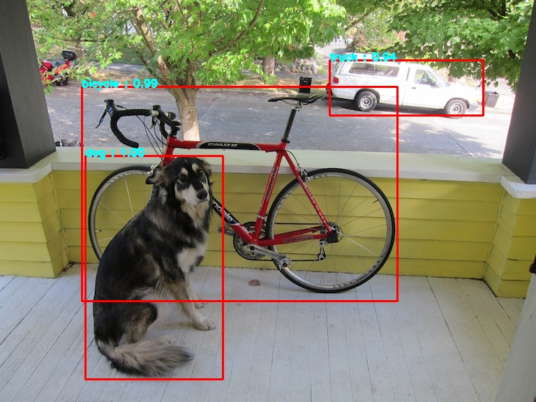

# Object-Detection
The code implements Object Detection using YOLOv3. The code has been implemented using the OpenCV library.
It uses a YOLOv3 model pre-trained on the COCO dataset.

### Dependencies

<ul>
    <li>
        <a href="https://opencv.org/" >OpenCV</a>
    </li>
    <li>
        <a href="https://numpy.org/" >NumPy</a>
    </li>
</ul>

The weights can be downloaded from the following link :-
```
https://pjreddie.com/media/files/yolov3.weights
```

#### Input 


#### Output



No. of objects detected - 3 <br>
